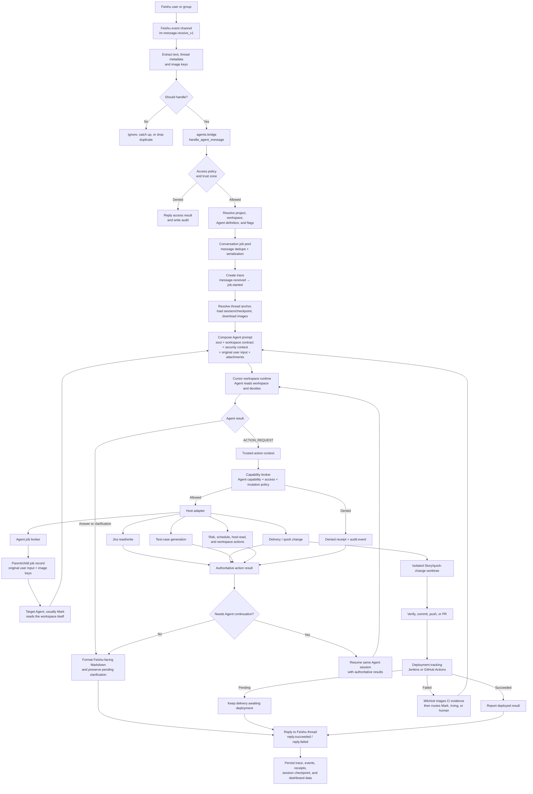

# Lumon message lifecycle

This is the current runtime path for one Feishu message. It describes what is
implemented today, including the internal action channel and the long-running
delivery/deployment branch.

## End-to-end architecture



## What each stage does

| Stage | Responsibility | Main implementation |
| --- | --- | --- |
| 1. Feishu ingress | Receives `im.message.receive_v1`, buffers startup catch-up events, filters messages, and deduplicates by Agent + message ID. | `lib/feishu/channel.py`, `lib/feishu/handlers.py` |
| 2. Gateway and policy | Selects the Agent entry point, resolves the project, and applies access/trust-zone/mutation policy before work starts. | `lib/agents/bridge.py`, `lib/agents/security/access_policy.py` |
| 3. Job and trace | Runs the turn through the conversation pool and records the trace, events, latency, and failure state. | `lib/agents/runtime/jobs_pool.py`, `lib/agents/runtime/observability.py` |
| 4. Session context | Chooses the conversation scope, resumes or resets the Agent session, anchors replies to the latest message, and loads the mapped workspace. | `lib/agents/runtime/session_store.py`, `lib/agents/runtime/autonomous.py` |
| 5. Prompt and workspace | Builds the Agent context from the Agent definition, soul, workspace contract, security context, original user input, and downloaded Feishu images. | `lib/agents/*/definition.py`, `lib/agents/*/session_bootstrap.py`, `lib/agents/runtime/autonomous.py` |
| 6. Agent decision | The workspace Agent reads evidence and decides whether to answer, ask one focused clarification, or request a host action. | Cursor runtime + Agent prompts |
| 7. Action execution | The internal `ACTION_REQUEST` envelope is validated and executed by the host broker. It is never a user-facing step. | `lib/agents/runtime/final_response.py`, `lib/agents/security/broker.py` |
| 8. Continuation | Read results are returned to the same Agent session when the user’s goal is not complete, so a Jira query can continue into test-case generation or delegation. | `lib/agents/runtime/autonomous.py` |
| 9. Delegation | Milchick creates a parent/child job. The child handoff carries the original user text and image keys; Mark reads the workspace and decides the implementation path himself. | `lib/agents/jobs/broker.py` |
| 10. Reply and observability | The final reply is sent back to the same Feishu thread, then the trace, events, receipts, and session checkpoint remain available to the Dashboard. | `lib/agents/bridge.py`, `lib/scripts/dashboard_server.py` |

## Long-running delivery branch

For a tracked change, the synchronous Agent turn ends with a truthful state such
as “submitted” or “awaiting deployment”. The delivery worker then continues
outside the conversational turn:

```mermaid
sequenceDiagram
    participant User as Feishu user
    participant Mark as Mark
    participant Lumen as Lumon host
    participant Repo as isolated worktree
    participant CI as Jenkins / GitHub Actions

    User->>Mark: Request a delivery or quick change
    Mark->>Lumen: Internal delivery action
    Lumen->>Repo: Prepare and modify isolated worktree
    Repo-->>Lumen: Verification evidence
    Lumen->>CI: Push / PR / deployment trigger
    Lumen-->>User: Submitted; deployment is being tracked
    CI-->>Lumen: Pending, success, or failure
    alt success
        Lumen-->>User: Deployment completed with provider evidence
    else failure
        Lumen->>Milchick: New follow-up turn with original request + CI evidence
        Milchick->>Mark: Source/build/delivery repair when appropriate
        Milchick->>Irving: Jira repair when appropriate
    end
```

`lib/scripts/deployment_tracking.py` is provider-aware: it polls Jenkins when
the workspace selects `jenkins` and GitHub Actions when it selects
`github_actions`. The durable worker owns the timer and provider HTTP/CLI
boundary; Milchick owns the Agent-level result report and failure triage. The
provider is configuration, not a different Agent flow.

## Important boundaries

- User input and attachments are data carried through the pipeline; they are
  not replaced by a manager’s summary during delegation.
- The Agent decides the next step. Lumon supplies execution boundaries,
  durable state, and auditability; it should not classify every request with a
  large hard-coded `if/else` router.
- `ACTION_REQUEST` is an internal host protocol. Users should see the result,
  question, or blocker—not the envelope.
- A completed conversational reply is not necessarily a completed deployment.
  Delivery status remains pending until the configured CI/CD provider reports a
  terminal result.
