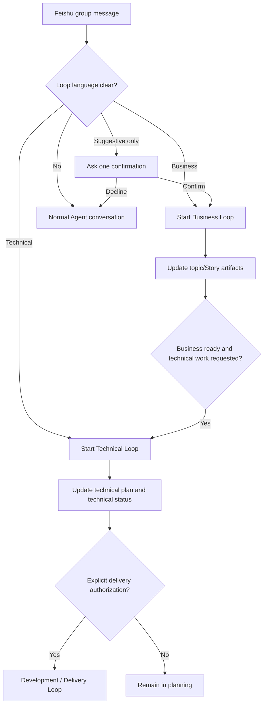

# Delivery Loop Design

Date: 2026-07-08

## Goal

Complete the Lumen delivery workflow with CLI-driven implementation of approved technical plans, deterministic verification, PR creation, and delivery state synchronization.

## Three-loop model

```text
Business Loop   -> story.md            (Codex / Cursor)
Technical Loop  -> technical-plan.md    (Codex / Cursor)
Development Loop -> code + PR          (lumen delivery run)
```

## Feishu Loop Gateway

Feishu is the conversation surface; the workspace remains the source of truth for `topic.md`, `story.md`, `technical-plan.md`, and `metadata.json`. Users do not need to name an internal Loop. Mark is the default group entry point when a message has clear requirement or technical-plan language and no Agent is mentioned; replies continue in the same Feishu thread.

| User language | Gateway decision | Workflow boundary |
|---|---|---|
| “Create/capture/turn this into a requirement” | Start Business Loop directly | Topic/Story artifacts only |
| “Turn this requirement into a technical plan/design” | Start Technical Loop directly | One business-ready Story and its technical plan |
| “Let’s整理/梳理 this requirement” | Ask one confirmation with options | No artifact change before confirmation |
| “What is the Business Loop?” | Normal conversation | No Loop starts |

The gateway persists a pending confirmation in the Agent session and the active Loop in its checkpoint. A numeric reply such as `1` or a natural confirmation such as “开始” resumes the same thread and starts the workflow. Starting either Loop is never delivery authorization: `delivery.start` still requires an explicit user instruction after Business and Technical gates are satisfied.



## Workspace layout

The docs repository is the delivery workspace. It owns the stable source checkouts, delivery state, and Story-specific feature worktrees:

```text
<docs-repo>/
  lumen/
    worktrees/<story-key>/<repository>/
    logs/delivery/
    results/
    history/delivery/
  repos/
    service-a/                 # base checkout; never developed on directly
    service-b/
  stories/
```

`lumen set-up-docs` can clone repositories into `repos/`. Lumen discovers them automatically; a Story only declares the repositories it affects in `metadata.json.linkedRepos`.

## Coding guideline location

The coding guideline lives in the Lumen CLI install:

```text
~/.lumon/lib/standards/coding-guideline.md
```

`lumen delivery run` injects it into the delivery agent prompt. It is not copied into the docs repository.

## CLI orchestration

From the workspace root: `lumen delivery run [--story <slug>] [--dry-run]`

Pipeline:

1. `sync_delivery_workspace.py` — fetch docs and linked base checkouts without pull, reset, or branch changes
2. `prepare_delivery_run.py` — metadata gates and Story-specific feature worktrees created from `origin/<base>`; base checkouts are never touched
3. `compose_delivery_prompt.py` — story, plan, coding guideline, workspace context
4. `run-delivery.sh` — Cursor agent implementation in prepared worktrees
5. `run_delivery_verification.py` — host Java/JDK selection, PMD when configured, full Gradle test suite, and Colima/Testcontainers runtime injection
6. `finalize_delivery.py` — commit using the Agent-proposed repository-style subject, push the feature branch, and open one PR per repository
7. `render-delivery-and-notify.py` — metadata, JIRA status, Feishu, and run history

`prepare`, `verify`, and `pr` remain internal recovery commands for interrupted runs. Normal users only use `lumen delivery run`.

Multiple Story worktrees can coexist, including worktrees for the same repository. To keep the control plane deterministic, Lumen runs one automated delivery at a time per docs repository; a second `run` reports that the workspace is busy instead of overwriting shared progress, notification, or JIRA state.

The Agent never commits, pushes, or transitions JIRA. Lumen only finalizes after mandatory verification passes.

## Local Java Runtime

Java verification runs on the host machine. For macOS/Colima Testcontainers support, initialize the profile once:

```bash
colima start --network-address
```

Lumen injects `DOCKER_HOST`, `TESTCONTAINERS_DOCKER_SOCKET_OVERRIDE`, and `TESTCONTAINERS_HOST_OVERRIDE` for Docker-requiring checks. Use `CODEARTIFACT_AUTH_TOKEN` in the active shell, or a trusted local `CODEARTIFACT_TOKEN_COMMAND` in docs `.env.local`, when Gradle needs a private dependency token.

## Visibility And Recovery

```bash
lumen delivery status ~/Projects/example-docs
lumen delivery watch ~/Projects/example-docs
lumen delivery dashboard ~/Projects/example-docs
```

Every completed or failed run is archived under `lumen/history/delivery/`; a failed run preserves its Story worktree so it can be diagnosed and retried safely.

## Non-goals

- No `standards/repos/` overrides in the docs repo
- No automatic merge
- Technical planning still runs interactively in Codex / Cursor
