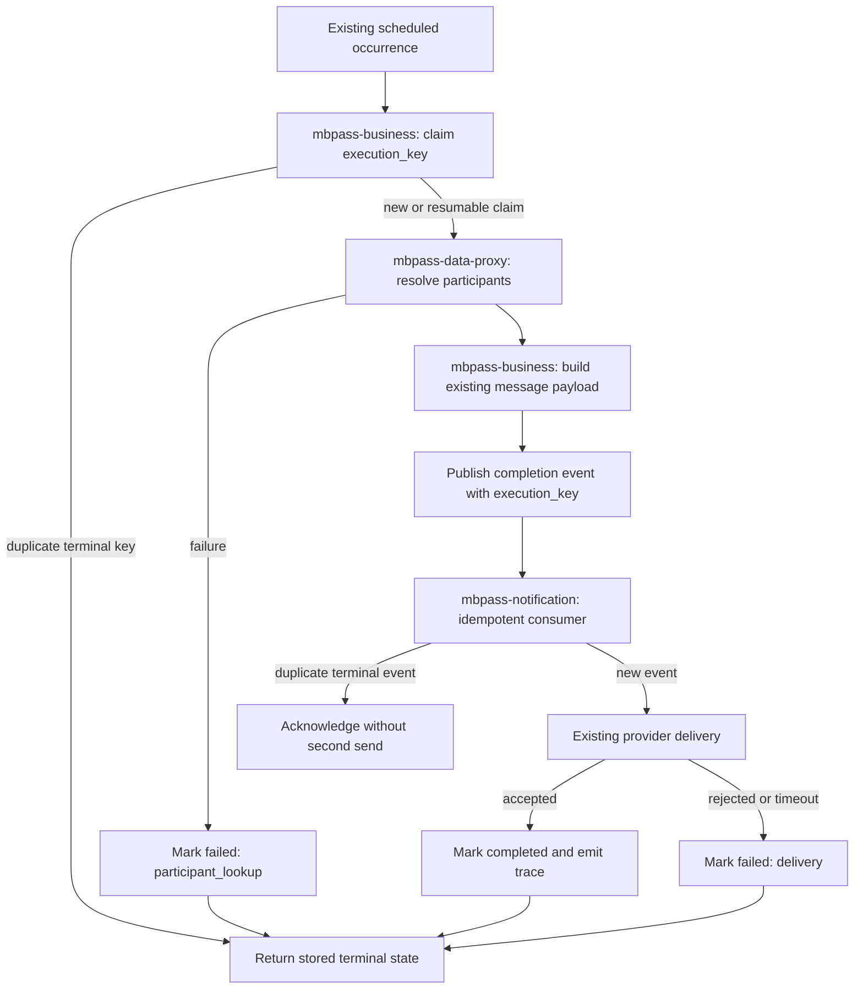

# Technical Plan: MBPAS-1437 Manual Raffle Event Notifications

## Goal & Scope

### Goal

For MBPAS-1437, the current delivery path starts from a scheduled Regular Raffle notification, resolves manually imported participants through the data service, creates outbound reminders or survey messages, and records completion markers. It does not have one durable execution identity across the scheduler, `mbpass-business`, `mbpass-data-proxy`, and the notification consumer. A worker restart or repeated event can therefore produce an ambiguous state and make an operator unable to distinguish a safe retry from a duplicate send.

This Story introduces a durable execution boundary across the existing services. A scheduled occurrence is claimed once, participant resolution remains owned by the data proxy, message creation remains owned by the business service, and the notification consumer accepts one idempotent completion record. The design preserves existing audience rules and message payloads while making state, failure, and inspection observable.

### Acceptance Criteria

- **AC1 — durable claim:** Every supported scheduled occurrence has one execution identity and at most one active worker claim.
- **AC2 — service ownership:** The business service owns orchestration and state; the data proxy owns participant lookup; the notification service owns outbound delivery.
- **AC3 — safe repetition:** A repeated trigger or consumer delivery does not create a second outbound message for a completed execution.
- **AC4 — failure visibility:** A timeout, participant lookup failure, or delivery rejection produces a terminal state with a stable failure category and trace reference.
- **AC5 — operator inspection:** An authorized operator can inspect the execution state, timestamps, service hand-offs, and failure category without exposing recipient content.
- **AC6 — compatibility:** Existing recipient filters, message payload schema, schedule cadence, and existing consumers continue to work during the transition.

### In Scope

- `mbpass-business`: scheduler adapter, Raffle orchestration state, execution API, event publisher, migration, and tests.
- `mbpass-admin`: authenticated management gateway and operator identity propagation; it does not own notification state.
- `mbpass-data-proxy`: participant lookup contract and trace propagation.
- `mbpass-notification`: completion consumer and idempotent delivery marker.
- The existing operations authorization scope and the existing trace/metric conventions.

### Out of Scope

- Dashboard or mobile UI, new audience-selection rules, changing message copy, replacing the scheduler, and bulk historical reconstruction of executions that happened before this Story.

## Technical Decisions

### Decision 1: Use one execution identity for the whole hand-off

**What is the problem?**

The scheduler event id, data-proxy request id, business message id, and notification provider id are currently different identifiers. They are useful inside their own services but cannot prove that a repeated scheduler event represents the same business occurrence. Creating a second independent orchestration id in every service would preserve the ambiguity and make support tracing dependent on timing.

**Decision content**

- Derive `execution_key` from the existing job definition and scheduled occurrence, then create it in `mbpass-business` before the first cross-service call.
- Propagate `execution_key` as a cross-service DTO field and retain each service's existing local request id for diagnostics.
- Treat the execution record as the source of orchestration state; provider ids remain delivery details and are not used as the claim key.

**Decision conclusion**

**`execution_key` is the single cross-service identity for one scheduled occurrence, while local request ids remain diagnostic metadata.**

### Decision 2: Claim before participant resolution

**What is the problem?**

Participant resolution can be slow or temporarily unavailable. If the claim happens after lookup, two scheduler deliveries can resolve the same audience concurrently and both proceed to message creation. If the claim happens first, a worker restart can leave a non-terminal record that needs a bounded retry decision rather than an untracked duplicate.

**Decision content**

- Persist `claimed` before calling `mbpass-data-proxy` and use the unique execution key to reject a concurrent claim.
- A worker may resume a non-terminal claim only after the existing lease/age rule is satisfied; the resume attempt keeps the same execution key.
- Participant results are treated as an input snapshot for this execution. A retry does not silently replace a completed snapshot.

**Decision conclusion**

**Claim first, then resolve participants, and resume only through the same durable execution identity.**

### Decision 3: Keep delivery completion idempotent at the consumer

**What is the problem?**

The notification service can receive a repeated completion event after an acknowledgement timeout. If it only trusts transport delivery, it may send the same message twice even though the business service has one terminal execution record.

**Decision content**

- Store the execution key alongside the existing outbound marker and treat an already-completed key as an acknowledged duplicate.
- Preserve the current message payload and recipient deduplication rules; the new marker changes only the acceptance boundary.

**Decision conclusion**

**The notification consumer must accept each terminal execution key once and make repeated completion events no-ops.**

## Architecture (usually one main diagram)

The scheduler adapter and business orchestration remain in `mbpass-business`. The data proxy is authoritative for participant lookup and returns the same participant representation already consumed by the message builder. The notification service is authoritative for outbound send acceptance and its existing provider error classification. The operations endpoint reads execution metadata from the business service and never returns the recipient list or message body.



### Repository / Service Responsibilities

- **`mbpass-business`:** owns `delivery_job` state, execution-key derivation, claim/resume rules, orchestration, operation inspection, and completion event publication.
- **`mbpass-data-proxy`:** owns participant lookup, existing filtering semantics, data-scope enforcement, and the propagated trace/execution fields.
- **`mbpass-notification`:** owns outbound provider invocation, the existing recipient/message marker, duplicate completion acceptance, and provider failure classification.
- **Operations boundary:** uses the current operator authorization scope and returns state/timestamps/category only. It must not become a second send command.

### Runtime, Permission, and Integration Boundaries

- **Runtime/config:** use the existing scheduled-worker profile and Dockerfiles. Add only the execution lease/age configuration if repository configuration already supports a bounded value; keep the key names out of code constants and document default ownership in the service config.
- **Permission/identity:** the scheduler uses its existing service identity. Participant lookup continues to enforce its current tenant/dealer scope. The inspection endpoint uses the existing operations permission and redacts recipient/message content.
- **Async/state:** the trigger is the current scheduled event; the consumer is the existing notification event handler. States are `claimed`, `resolving`, `published`, `completed`, and `failed`. Only the owner service may advance orchestration state, and terminal states are immutable.
- **Integration:** each hand-off carries `execution_key` and the existing trace id. Timeouts and provider rejections become stable categories, are logged with correlation metadata, and do not expose payload contents.

## API & Data Design

### API / Event / Config / Command Contract

The inspection endpoint is additive. Existing callers and consumers remain valid because the event fields are optional during the transition. New producers must send the execution key after the business service has claimed it; old consumers ignore it until their marker support is deployed.

```json
{
  "method": "GET",
  "path": "/internal/delivery-executions/{execution_key}",
  "auth": "existing operations scope",
  "response": {
    "executionKey": "string",
    "jobName": "string",
    "state": "claimed | resolving | published | completed | failed",
    "startedAt": "timestamp",
    "updatedAt": "timestamp",
    "finishedAt": "timestamp | null",
    "failureCategory": "string | null",
    "traceId": "string"
  }
}
```

The completion event adds `execution_key`, `state`, and `failure_category` as optional fields to the existing envelope. The notification consumer uses `(execution_key, terminal state)` as its acceptance key and keeps the existing provider request id for support. No command endpoint is added for manual resend.

### Database Design

The target schema must be reconciled with the actual `V18__delivery_events.sql` and the newer migration sequence before approval. The design below names the target only because the repository currently proves the existing event entity, repository, and index conventions. If the source uses another type, name, or migration version, update this plan and keep `technicalStatus` as `draft` until the final schema is confirmed.

### New table: delivery_job

**Purpose:** Store one durable orchestration record per scheduled occurrence, without storing recipient content or message bodies.

| Field | Type | Length / precision | Null | Default | Key / index | Explanation |
|---|---|---|---|---|---|---|
| `execution_key` | varchar | 160 | no | — | unique index | Cross-service identity and idempotency boundary. |
| `job_name` | varchar | 80 | no | — | ordinary index | Existing scheduled job definition. |
| `state` | varchar | 24 | no | `claimed` | ordinary index | Current orchestration state. |
| `started_at` | timestamp | — | no | current timestamp | — | First successful claim time. |
| `updated_at` | timestamp | — | no | current timestamp | ordinary index | Last state transition time. |
| `finished_at` | timestamp | yes | null | — | — | Terminal transition time. |
| `failure_category` | varchar | 64 | yes | null | ordinary index | Stable category such as `participant_lookup` or `delivery`. |
| `trace_id` | varchar | 128 | no | — | ordinary index | Redacted diagnostic correlation identifier. |

- **Indexes:** the unique execution key supports claims; state and updated time support operational inspection; trace id supports support searches according to existing index conventions.
- **Application relationship rules:** the execution key is validated at each service boundary; services must not infer ownership from a recipient id. Database foreign keys are not introduced.
- **Migration/data treatment:** create this table before producers write claims. Existing scheduled events have no reconstructed execution records and remain outside the inspection result until a new occurrence is processed.

### Modified table: delivery_event

**Change summary**

- **Before:** The event row stores the existing event id and payload but has no durable orchestration association.
- **After:** The final schema includes an optional `execution_key` and terminal state fields used by the notification marker.
- **Description:** The association lets a repeated event be acknowledged without changing the existing delivery payload.

**Final schema**

| Field | Type | Length / precision | Null | Default | Key / index | Explanation |
|---|---|---|---|---|---|---|
| `event_id` | bigint | — | no | generated | primary key | Existing event identifier; unchanged. |
| `execution_key` | varchar | 160 | yes | null | ordinary index | New association to `delivery_job`; absent for legacy events. |
| `terminal_state` | varchar | 24 | yes | null | ordinary index | New accepted terminal state for notification deduplication. |
| `payload` | json | — | no | — | — | Existing message payload; unchanged. |
| `provider_request_id` | varchar | 128 | yes | null | ordinary index | Existing provider diagnostic id; unchanged. |
| `created_at` | timestamp | — | no | current timestamp | — | Existing event creation time; unchanged. |
| `legacy_marker` | varchar | 80 | yes | null | — | Deleted after migration compatibility is proven; mark as removed in the final migration if it is the old duplicate marker. |

## Implementation Plan

### Dependency-ordered Changes

1. **`mbpass-business/db/migrations/V19__delivery_job.sql`:** verify the existing migration naming and create `delivery_job`; add the proven optional event columns in the next migration sequence. Add indexes only after checking current query/index definitions.
2. **`mbpass-business/domain/DeliveryJob` and repository:** map the final schema, implement the unique claim, resumable non-terminal state rule, terminal-state immutability, and read-only inspection query.
3. **`mbpass-business/scheduler/DeliveryJobRunner`:** derive the key from the existing occurrence, claim before lookup, call the existing data-proxy API, preserve the participant snapshot, publish the existing event envelope with optional fields, and classify failures.
4. **`mbpass-data-proxy/api/ParticipantLookup`:** accept and propagate the execution/trace fields without changing filtering or tenant scope. Add a compatibility test for an old caller without the optional field if the current API supports one.
5. **`mbpass-notification/consumer/DeliveryEventConsumer`:** accept the optional fields, persist the marker atomically with the existing send acceptance boundary, acknowledge duplicate terminal events, and retain provider error handling.
6. **Operations and tests:** expose the read-only endpoint under the existing authorization guard, add trace/metric assertions, and run the repository's focused migration, service, contract, consumer, and architecture checks.

### Design-significant Identifiers

- `execution_key`: persisted and cross-service identity for one scheduled occurrence.
- `failure_category`: stable diagnostic classification, not a raw provider message.
- `terminal_state`: notification acceptance marker; it is not a replacement for orchestration `state`.
- `DeliveryJobRunner.claim`: public/shared method only if the existing service boundary exposes it; otherwise keep the claim operation inside the existing orchestration service.

## Verification

- **Cross-repository contract:** send the event through the existing producer and consumer versions; verify optional fields are preserved, old consumers remain valid, and the same execution key appears in the business trace and notification marker.
- **Persistence/migration:** apply migrations to an empty database and a database containing existing event rows; verify nullability, defaults, indexes, the deleted legacy field treatment, and read-back of final names. If any migration source disagrees with this plan, keep `technicalStatus=draft` and reconcile it before approval.
- **Claim/idempotency:** deliver two identical scheduled triggers concurrently; verify one active claim, one participant lookup, one message acceptance, and one terminal result. Repeat a completion event after an acknowledgement timeout and verify no second send.
- **Async/state:** exercise `claimed`, participant lookup failure, published, provider rejection, timeout, and successful completion. Verify terminal states do not transition silently and resumable non-terminal work keeps the same execution key.
- **Permission/identity:** query as an authorized operator, an unrelated actor, and a service identity; verify the correct allow/deny behavior and that recipient/message content is never returned.
- **Existing regression:** run each repository's supported migration, focused unit, contract, consumer, static, and architecture checks; do not claim a heavy environment-dependent build unless the repository provides that profile.

## Risks / Open Questions

- The exact migration version and legacy marker name must be confirmed from the current repository before schema approval.
- A worker crash after claim but before participant lookup needs the existing lease/age value; if no repository convention exists, this is an owner decision that keeps the plan draft.
- Old event consumers may not persist the optional execution fields. The transition must preserve their existing behavior until the consumer contract is deployed.
- Historical executions are intentionally not reconstructed, so operator inspection begins at the first occurrence handled by the new producer.
